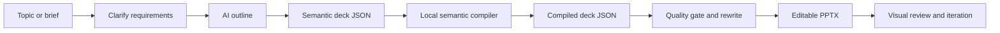
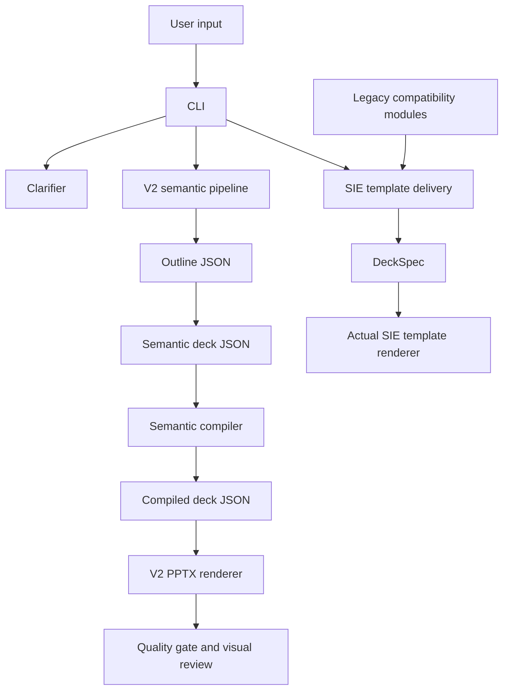
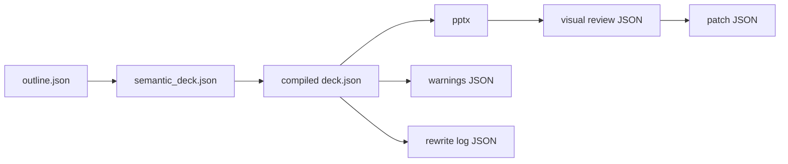
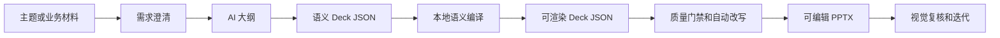
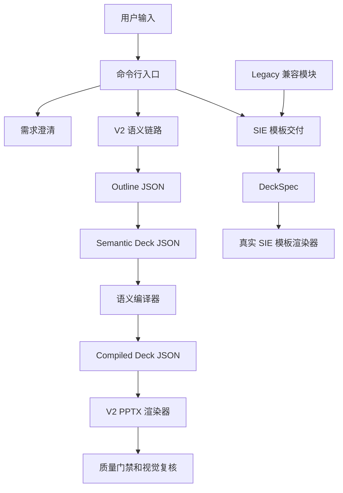

# Enterprise-AI-PPT

AI-assisted planning plus deterministic PowerPoint rendering for enterprise-grade business presentations.

- [English](#english)
- [中文](#中文)

> Diagram note: all flowcharts use default Mermaid styling without hard-coded fill colors, so they stay readable in browser light mode and dark mode.

---

## English

### What This Project Does

`Enterprise-AI-PPT` turns a business topic, brief, structured outline, or existing deck JSON into editable `.pptx` files. It is built for enterprise reporting scenarios where the output must be reviewable, traceable, and editable instead of being a one-off AI image or loose text draft.

The current product direction is **V2-first**:

- AI plans the story and semantic content.
- Local compilers choose schema-safe layouts.
- Deterministic renderers generate editable PowerPoint files.
- Quality gates, content rewriting, and visual review loops help catch issues before delivery.
- Legacy/SIE template delivery remains available, but it is isolated behind compatibility boundaries.

### Best-Fit Use Cases

- Executive briefings and management reports.
- Consulting-style proposals.
- Project phase reports and roadmap decks.
- Industry research or business analysis decks.
- Customer-facing solution introductions.
- Structured material to PowerPoint conversion.

### Workflow Overview



### Architecture Overview



### Current Capabilities

- One-shot topic-to-PPT generation through the V2 semantic pipeline.
- Step-by-step generation: outline, semantic deck, compiled deck, render.
- Actual SIE template rendering through `sie-render`.
- Single-page SIE business slide generation through `onepage`.
- Clarification flow for vague requests.
- Local deterministic layout compilation.
- Semantic layouts including `timeline`, `stats_dashboard`, `matrix_grid`, `cards_grid`, `two_columns`, `title_image`, `title_content`, `title_only`, and `section_break`.
- Manifest-backed legacy pattern variants for the SIE template path.
- Rule-based quality gate with clear hard-blocking versus soft-issue statistics.
- Content rewrite pass for fixable title, density, repetition, and structure issues.
- Visual review loop with a 9-dimension scorecard and provider injection point.
- OpenAI-compatible LLM access, including local gateway setups through `OPENAI_BASE_URL`.

### Install

```powershell
python -m venv .venv
.\.venv\Scripts\activate
python -m pip install --upgrade pip
python -m pip install -e .[dev]
```

Installed commands:

- `enterprise-ai-ppt`
- `sie-autoppt`

You can also run the project without installing the console command:

```powershell
python .\main.py --help
```

### Environment

For AI generation, set an OpenAI-compatible API key:

```powershell
$env:OPENAI_API_KEY="your-api-key"
```

Optional local gateway:

```powershell
$env:OPENAI_BASE_URL="http://localhost:8000/v1"
```

Useful optional variables:

- `SIE_AUTOPPT_LLM_MODEL`: default model override.
- `SIE_AUTOPPT_LLM_TIMEOUT_SEC`: request timeout.
- `SIE_AUTOPPT_LLM_REASONING_EFFORT`: reasoning effort hint for compatible providers.
- `SIE_AUTOPPT_LLM_VERBOSITY`: text verbosity hint for compatible providers.

### Quick Start

Run a no-AI smoke test:

```powershell
enterprise-ai-ppt demo
```

Generate a full V2 deck:

```powershell
enterprise-ai-ppt make `
  --topic "Enterprise AI adoption roadmap" `
  --brief "Audience: executive team. Focus on current pain points, target architecture, phased rollout, and expected value." `
  --generation-mode deep `
  --min-slides 6 `
  --max-slides 8
```

Render with the actual SIE template path:

```powershell
enterprise-ai-ppt sie-render `
  --topic "Supply chain traceability program" `
  --brief "Customer proposal covering regulatory pressure, pain points, architecture, implementation path, and value."
```

Run visual review on an existing deck JSON:

```powershell
enterprise-ai-ppt review `
  --deck-json .\output\generated_deck.json
```

Generate HTML visual draft artifacts before PPTX delivery:

```powershell
enterprise-ai-ppt visual-draft `
  --deck-spec-json .\samples\visual_draft\why_sie_choice.deck_spec.json `
  --output-dir .\output\visual_draft `
  --output-name why_sie_choice `
  --layout-hint auto `
  --visual-rules-path .\tools\sie_autoppt\visual_default_rules.toml `
  --with-ai-review
```

Run multi-round review and patch iteration:

```powershell
enterprise-ai-ppt iterate `
  --deck-json .\output\generated_deck.json `
  --max-rounds 2
```

### Recommended Workflows

#### 1. One-Shot Generation

Use this when you want a fast first draft.

```powershell
enterprise-ai-ppt make `
  --topic "Manufacturing AI operations report" `
  --brief "For management review. Cover business issues, target state, rollout path, and expected benefits." `
  --generation-mode deep `
  --min-slides 6 `
  --max-slides 10
```

#### 2. Plan First, Render Later

Use this when the storyline needs review before rendering.

```powershell
enterprise-ai-ppt v2-plan `
  --topic "Data governance platform proposal" `
  --brief "Client proposal focused on current data fragmentation, governance design, roadmap, and value." `
  --plan-output .\projects\generated\data_governance.deck.json `
  --semantic-output .\projects\generated\data_governance.semantic.json
```

```powershell
enterprise-ai-ppt v2-render `
  --deck-json .\projects\generated\data_governance.deck.json `
  --ppt-output .\projects\generated\Data_Governance_Proposal.pptx
```

#### 3. Clarify Before Generation

Use this when the request is vague.

```powershell
enterprise-ai-ppt clarify `
  --topic "Help me make a PPT about internal traceability"
```

```powershell
enterprise-ai-ppt clarify-web
```

#### 4. Actual SIE Template Delivery

Use this when the output must use the real SIE PPTX template.

```powershell
enterprise-ai-ppt sie-render `
  --structure-json .\projects\generated\traceability.structure.json `
  --topic "Supply chain traceability proposal" `
  --ppt-output .\projects\generated\Traceability_SIE_Template.pptx
```

#### 5. Review And Iterate

Use this after you already have a deck JSON.

```powershell
enterprise-ai-ppt v2-review `
  --deck-json .\output\generated_deck.json
```

```powershell
enterprise-ai-ppt v2-iterate `
  --deck-json .\output\generated_deck.json `
  --max-rounds 2
```

### Main CLI Commands

| Command | Purpose | Needs AI | Main output |
|---|---|---:|---|
| `demo` | Render bundled sample deck | No | `.pptx`, logs, warning JSON |
| `make` | Recommended full V2 generation | Yes | outline, semantic deck, compiled deck, `.pptx` |
| `review` | One-pass visual review alias for `v2-review` | No | review JSON, patch JSON |
| `iterate` | Multi-round review alias for `v2-iterate` | No | final review, patched deck, `.pptx` |
| `visual-draft` | Generate VisualSpec + HTML draft + screenshot + rule score (AI review optional) | No (optional) | `.visual_spec.json`, `.preview.html`, `.preview.png`, scoring JSON |
| `onepage` | Generate one SIE-style business slide | Optional | one-page `.pptx` |
| `sie-render` | Actual SIE template delivery path | Optional | SIE-template `.pptx`, trace JSON |
| `clarify` | Clarify vague requirements | Optional | clarifier session JSON |
| `clarify-web` | Browser UI for clarification | Optional | local web app |
| `v2-outline` | Generate outline only | Yes | outline JSON |
| `v2-plan` | Generate outline, semantic deck, compiled deck | Yes | JSON artifacts |
| `v2-compile` | Compile semantic deck to renderable deck | No | compiled deck JSON |
| `v2-render` | Render from semantic or compiled deck JSON | No | `.pptx` |
| `v2-make` | Explicit V2 full pipeline | Yes | JSON artifacts and `.pptx` |
| `v2-review` | Explicit one-pass review | No | review artifacts |
| `v2-iterate` | Explicit multi-round review | No | final review and patched deck |
| `ai-check` | AI connectivity and pipeline healthcheck | Yes | healthcheck JSON |

See [docs/CLI_REFERENCE.md](./docs/CLI_REFERENCE.md) for more examples.

### Intermediate Artifacts



- `outline.json`: high-level story structure.
- `semantic_deck.json`: AI-facing semantic content contract.
- `compiled deck.json`: renderer-facing layout contract.
- `.pptx`: editable PowerPoint output.
- warning / rewrite / review / patch JSON: traceability and QA artifacts.

### Quality System

The V2 path uses two complementary quality layers:

- **Rule-based quality gate**: detects schema errors, severe overflow risks, density issues, repeated pages, weak openings/endings, quantified claims without sources, and other deterministic issues.
- **Visual review loop**: evaluates presentation quality and can request blocker-level patches.

The current visual review scorecard has 9 dimensions:

- `structure`
- `title_quality`
- `content_density`
- `layout_stability`
- `deliverability`
- `brand_consistency`
- `data_visualization`
- `info_hierarchy`
- `audience_fit`

`errors` are hard blockers. `warnings` and `high` findings are soft signals used for statistics and review context.

### V2 Themes

Themes are discovered from `tools/sie_autoppt/v2/themes/`.

Common theme names include:

- `business_red`
- `tech_blue`
- `fresh_green`
- `google_brand_light`
- `anthropic_orange`
- `mckinsey_blue`
- `consulting_navy`

Example:

```powershell
enterprise-ai-ppt make `
  --topic "Quarterly operations review" `
  --theme consulting_navy
```

### Repository Layout

| Path | Purpose |
|---|---|
| [main.py](./main.py) | Local entrypoint wrapper |
| [tools/sie_autoppt](./tools/sie_autoppt/) | Main Python package |
| [tools/sie_autoppt/v2](./tools/sie_autoppt/v2/) | V2 semantic pipeline, renderer, quality checks, visual review |
| [tools/sie_autoppt/legacy](./tools/sie_autoppt/legacy/) | Isolated legacy/SIE compatibility implementation |
| [assets/templates](./assets/templates/) | SIE template and manifest assets |
| [samples](./samples/) | Sample input and deck fixtures |
| [docs](./docs/) | Architecture, CLI, compatibility, and QA docs |
| [tests](./tests/) | Regression test suite |

### Key Documents

- [CLI Reference](./docs/CLI_REFERENCE.md)
- [Deck JSON Spec](./docs/DECK_JSON_SPEC.md)
- [PPT Workflow](./docs/PPT_WORKFLOW.md)
- [Legacy Boundary](./docs/LEGACY_BOUNDARY.md)
- [Scoring System Review Decisions](./docs/SCORING_SYSTEM_REVIEW_DECISIONS.md)
- [Token System Plan](./docs/TOKEN_SYSTEM_PLAN.md)
- [Testing](./docs/TESTING.md)
- [Compatibility](./docs/COMPATIBILITY.md)

### Development

Run tests:

```powershell
python -m pytest -q
```

Run a focused V2 test set:

```powershell
python -m pytest tests/test_v2_schema.py tests/test_v2_render.py tests/test_v2_visual_review.py -q
```

Run a healthcheck:

```powershell
enterprise-ai-ppt ai-check `
  --topic "Enterprise AI report healthcheck" `
  --with-render
```

### Current Boundaries

- Use `make`, `v2-*`, `review`, and `iterate` for the active V2 semantic path.
- Use `sie-render` or `onepage` when the actual SIE template output is required.
- Legacy HTML/template internals are retained for compatibility, but they are not the recommended user path.
- Renderer coordinates are local implementation details. AI outputs semantic content, not raw geometry.

---

## 中文

### 项目定位

`Enterprise-AI-PPT` 是一个面向企业汇报场景的 AI PPT 生成与渲染项目。它的目标不是生成一张不可编辑的图片，也不是只让 AI 写一段 PPT 文案，而是把“需求理解、结构规划、语义内容、确定性渲染、质量复核”串成一条可复用的交付链路，最终输出可继续编辑的 `.pptx` 文件。

当前项目是 **V2 优先**：

- AI 负责规划故事线和语义内容。
- 本地 compiler 负责选择符合 schema 的布局。
- 本地 renderer 负责生成可编辑 PowerPoint。
- quality gate、content rewrite 和 visual review 负责在交付前发现并修复问题。
- legacy/SIE 模板能力仍保留，但已经隔离到兼容边界内。

### 适用场景

- 管理层汇报和经营复盘。
- 咨询方案与客户提案。
- 项目阶段汇报和路线图。
- 行业研究与业务分析。
- 解决方案介绍。
- 结构化材料转 PowerPoint。

### 流程总览



### 架构总览



### 当前能力

- 一句话主题到 PPT 的 V2 全流程生成。
- 分步生成：大纲、语义 deck、编译 deck、PPT 渲染。
- 通过 `sie-render` 使用真实 SIE 模板输出。
- 通过 `onepage` 生成单页 SIE 风格业务页。
- 对模糊需求先做澄清。
- 本地确定性布局编译。
- 支持 `timeline`、`stats_dashboard`、`matrix_grid`、`cards_grid`、`two_columns`、`title_image`、`title_content`、`title_only`、`section_break` 等语义布局。
- SIE 模板链路的 pattern variants 已由 manifest 承载。
- 规则质量门禁明确区分硬阻塞和软问题统计。
- 自动改写可修复标题、密度、重复、首尾页等问题。
- 视觉复核使用 9 维评分体系，并提供 provider 注入点。
- 支持 OpenAI 兼容接口，也可通过 `OPENAI_BASE_URL` 接入本地网关。

### 安装

```powershell
python -m venv .venv
.\.venv\Scripts\activate
python -m pip install --upgrade pip
python -m pip install -e .[dev]
```

安装后可用命令：

- `enterprise-ai-ppt`
- `sie-autoppt`

也可以不安装命令，直接运行：

```powershell
python .\main.py --help
```

### 环境变量

AI 生成需要 OpenAI 兼容 API key：

```powershell
$env:OPENAI_API_KEY="your-api-key"
```

如果使用本地或私有网关：

```powershell
$env:OPENAI_BASE_URL="http://localhost:8000/v1"
```

常用可选变量：

- `SIE_AUTOPPT_LLM_MODEL`：默认模型。
- `SIE_AUTOPPT_LLM_TIMEOUT_SEC`：请求超时。
- `SIE_AUTOPPT_LLM_REASONING_EFFORT`：兼容 provider 的 reasoning effort。
- `SIE_AUTOPPT_LLM_VERBOSITY`：兼容 provider 的输出详细度。

### 快速开始

无 AI 冒烟测试：

```powershell
enterprise-ai-ppt demo
```

生成一套 V2 PPT：

```powershell
enterprise-ai-ppt make `
  --topic "企业 AI 应用落地路线图" `
  --brief "面向管理层，突出当前痛点、目标架构、分阶段推进和预期价值。" `
  --generation-mode deep `
  --min-slides 6 `
  --max-slides 8
```

走真实 SIE 模板交付链路：

```powershell
enterprise-ai-ppt sie-render `
  --topic "供应链追溯体系建设方案" `
  --brief "客户提案，覆盖监管压力、现状痛点、方案架构、实施路径和业务价值。"
```

对已有 deck JSON 做视觉复核：

```powershell
enterprise-ai-ppt review `
  --deck-json .\output\generated_deck.json
```

进行多轮复核和自动 patch：

```powershell
enterprise-ai-ppt iterate `
  --deck-json .\output\generated_deck.json `
  --max-rounds 2
```

### 推荐流程

#### 1. 一句话生成

适合快速生成初稿。

```powershell
enterprise-ai-ppt make `
  --topic "制造企业 AI 运营汇报" `
  --brief "面向管理层，覆盖业务问题、目标状态、落地路径和预期收益。" `
  --generation-mode deep `
  --min-slides 6 `
  --max-slides 10
```

#### 2. 先规划，再渲染

适合先确认故事线，再输出 PPT。

```powershell
enterprise-ai-ppt v2-plan `
  --topic "数据治理平台建设方案" `
  --brief "客户提案，重点讲清数据分散现状、治理方案、实施路线和价值。" `
  --plan-output .\projects\generated\data_governance.deck.json `
  --semantic-output .\projects\generated\data_governance.semantic.json
```

```powershell
enterprise-ai-ppt v2-render `
  --deck-json .\projects\generated\data_governance.deck.json `
  --ppt-output .\projects\generated\Data_Governance_Proposal.pptx
```

#### 3. 先澄清需求

适合需求还比较模糊的情况。

```powershell
enterprise-ai-ppt clarify `
  --topic "帮我做一套内部追溯体系介绍 PPT"
```

```powershell
enterprise-ai-ppt clarify-web
```

#### 4. 真实 SIE 模板交付

适合必须使用 SIE PPTX 模板的交付。

```powershell
enterprise-ai-ppt sie-render `
  --structure-json .\projects\generated\traceability.structure.json `
  --topic "供应链追溯体系建设方案" `
  --ppt-output .\projects\generated\Traceability_SIE_Template.pptx
```

#### 5. 复核和迭代

适合已有 deck JSON，需要继续检查和修复。

```powershell
enterprise-ai-ppt v2-review `
  --deck-json .\output\generated_deck.json
```

```powershell
enterprise-ai-ppt v2-iterate `
  --deck-json .\output\generated_deck.json `
  --max-rounds 2
```

### 主要命令

| 命令 | 用途 | 是否需要 AI | 主要输出 |
|---|---|---:|---|
| `demo` | 渲染内置示例 | 否 | `.pptx`、日志、warning JSON |
| `make` | 推荐的 V2 全流程生成入口 | 是 | outline、semantic deck、compiled deck、`.pptx` |
| `review` | `v2-review` 的别名 | 否 | review JSON、patch JSON |
| `iterate` | `v2-iterate` 的别名 | 否 | final review、patched deck、`.pptx` |
| `onepage` | 生成单页 SIE 风格业务页 | 可选 | 单页 `.pptx` |
| `sie-render` | 真实 SIE 模板交付链路 | 可选 | SIE 模板 `.pptx`、trace JSON |
| `clarify` | 澄清模糊需求 | 可选 | clarifier session JSON |
| `clarify-web` | 本地浏览器澄清界面 | 可选 | 本地 Web 页面 |
| `v2-outline` | 只生成大纲 | 是 | outline JSON |
| `v2-plan` | 生成大纲、语义 deck、编译 deck | 是 | JSON 产物 |
| `v2-compile` | 语义 deck 编译为可渲染 deck | 否 | compiled deck JSON |
| `v2-render` | 从语义或编译 deck 渲染 | 否 | `.pptx` |
| `v2-make` | 显式 V2 全流程 | 是 | JSON 产物和 `.pptx` |
| `v2-review` | 显式单轮复核 | 否 | review artifacts |
| `v2-iterate` | 显式多轮复核 | 否 | final review 和 patched deck |
| `ai-check` | AI 连通性和流程健康检查 | 是 | healthcheck JSON |

更多示例见 [docs/CLI_REFERENCE.md](./docs/CLI_REFERENCE.md)。

### 中间产物


- `outline.json`：高层故事线。
- `semantic_deck.json`：AI 面向的语义内容契约。
- `compiled deck.json`：renderer 面向的布局契约。
- `.pptx`：最终可编辑 PowerPoint。
- warning / rewrite / review / patch JSON：质量追踪与复核产物。

### 质量体系

V2 链路有两层质量机制：

- **规则质量门禁**：检查 schema error、严重溢出风险、内容密度、重复页面、首尾页弱表达、量化结论缺少来源等确定性问题。
- **视觉复核循环**：评估整套 PPT 的交付质量，并可针对 blocker 生成 patch。

当前视觉评分为 9 个维度：

- `structure`
- `title_quality`
- `content_density`
- `layout_stability`
- `deliverability`
- `brand_consistency`
- `data_visualization`
- `info_hierarchy`
- `audience_fit`

`errors` 是硬阻塞；`warnings` 和 `high` 是软信号，会进入统计和复核上下文。

### V2 主题

主题从 `tools/sie_autoppt/v2/themes/` 自动发现。

常见主题：

- `business_red`
- `tech_blue`
- `fresh_green`
- `google_brand_light`
- `anthropic_orange`
- `mckinsey_blue`
- `consulting_navy`

示例：

```powershell
enterprise-ai-ppt make `
  --topic "季度经营复盘" `
  --theme consulting_navy
```

### 仓库结构

| 路径 | 说明 |
|---|---|
| [main.py](./main.py) | 本地入口包装 |
| [tools/sie_autoppt](./tools/sie_autoppt/) | 主 Python 包 |
| [tools/sie_autoppt/v2](./tools/sie_autoppt/v2/) | V2 语义链路、渲染器、质量检查、视觉复核 |
| [tools/sie_autoppt/legacy](./tools/sie_autoppt/legacy/) | 隔离后的 legacy/SIE 兼容实现 |
| [assets/templates](./assets/templates/) | SIE 模板和 manifest |
| [samples](./samples/) | 示例输入和 deck fixtures |
| [docs](./docs/) | 架构、CLI、兼容性和 QA 文档 |
| [tests](./tests/) | 回归测试 |

### 重要文档

- [CLI Reference](./docs/CLI_REFERENCE.md)
- [Deck JSON Spec](./docs/DECK_JSON_SPEC.md)
- [PPT Workflow](./docs/PPT_WORKFLOW.md)
- [Legacy Boundary](./docs/LEGACY_BOUNDARY.md)
- [Scoring System Review Decisions](./docs/SCORING_SYSTEM_REVIEW_DECISIONS.md)
- [Token System Plan](./docs/TOKEN_SYSTEM_PLAN.md)
- [Testing](./docs/TESTING.md)
- [Compatibility](./docs/COMPATIBILITY.md)

### 开发与测试

运行全量测试：

```powershell
python -m pytest -q
```

运行 V2 相关测试：

```powershell
python -m pytest tests/test_v2_schema.py tests/test_v2_render.py tests/test_v2_visual_review.py -q
```

运行健康检查：

```powershell
enterprise-ai-ppt ai-check `
  --topic "企业 AI 汇报健康检查" `
  --with-render
```

### 当前边界

- 推荐使用 `make`、`v2-*`、`review`、`iterate` 走 V2 语义链路。
- 需要真实 SIE 模板输出时，使用 `sie-render` 或 `onepage`。
- legacy HTML/template 内部能力保留用于兼容，但不再作为推荐用户路径。
- AI 输出语义内容，不输出原始坐标；renderer 坐标是本地实现细节。
